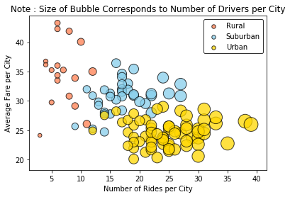
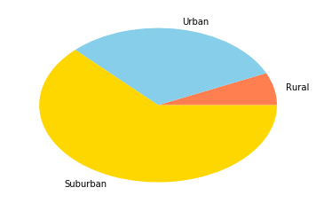
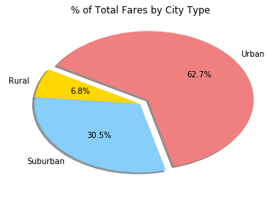
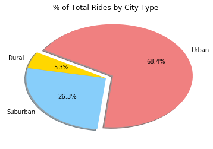
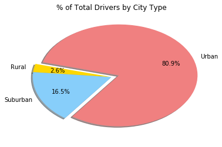

```

```


<div>
<style scoped>
    .dataframe tbody tr th:only-of-type {
        vertical-align: middle;
    }

    .dataframe tbody tr th {
        vertical-align: top;
    }

    .dataframe thead th {
        text-align: right;
    }
</style>
<table border="1" class="dataframe">
  <thead>
    <tr style="text-align: right;">
      <th></th>
      <th>city</th>
      <th>date</th>
      <th>fare</th>
      <th>ride_id</th>
      <th>driver_count</th>
      <th>type</th>
    </tr>
  </thead>
  <tbody>
    <tr>
      <th>0</th>
      <td>Lake Jonathanshire</td>
      <td>2018-01-14 10:14:22</td>
      <td>13.83</td>
      <td>5739410935873</td>
      <td>5</td>
      <td>Urban</td>
    </tr>
    <tr>
      <th>1</th>
      <td>South Michelleport</td>
      <td>2018-03-04 18:24:09</td>
      <td>30.24</td>
      <td>2343912425577</td>
      <td>72</td>
      <td>Urban</td>
    </tr>
    <tr>
      <th>2</th>
      <td>Port Samanthamouth</td>
      <td>2018-02-24 04:29:00</td>
      <td>33.44</td>
      <td>2005065760003</td>
      <td>57</td>
      <td>Urban</td>
    </tr>
    <tr>
      <th>3</th>
      <td>Rodneyfort</td>
      <td>2018-02-10 23:22:03</td>
      <td>23.44</td>
      <td>5149245426178</td>
      <td>34</td>
      <td>Urban</td>
    </tr>
    <tr>
      <th>4</th>
      <td>South Jack</td>
      <td>2018-03-06 04:28:35</td>
      <td>34.58</td>
      <td>3908451377344</td>
      <td>46</td>
      <td>Urban</td>
    </tr>
  </tbody>
</table>
</div>


```
%matplotlib inline
# Dependencies and Setup
import matplotlib.pyplot as plt
import pandas as pd
import numpy as np

# File to Load (Remember to change these)
city_data_to_load = "data/city_data.csv"
ride_data_to_load = "data/ride_data.csv"

# Read the City and Ride Data
city_info = pd.read_csv(city_data_to_load)
city_info.head()

ride_info = pd.read_csv(ride_data_to_load)
ride_info.head(-10)

# Combine the data into a single dataset
uber_df = pd.merge(ride_info,city_info,how="left",on=["city"])
uber_df
# Display the data table for preview

```


<div>
<style scoped>
    .dataframe tbody tr th:only-of-type {
        vertical-align: middle;
    }

    .dataframe tbody tr th {
        vertical-align: top;
    }

    .dataframe thead th {
        text-align: right;
    }
</style>
<table border="1" class="dataframe">
  <thead>
    <tr style="text-align: right;">
      <th></th>
      <th>city</th>
      <th>date</th>
      <th>fare</th>
      <th>ride_id</th>
      <th>driver_count</th>
      <th>type</th>
    </tr>
  </thead>
  <tbody>
    <tr>
      <th>0</th>
      <td>Lake Jonathanshire</td>
      <td>2018-01-14 10:14:22</td>
      <td>13.83</td>
      <td>5739410935873</td>
      <td>5</td>
      <td>Urban</td>
    </tr>
    <tr>
      <th>1</th>
      <td>South Michelleport</td>
      <td>2018-03-04 18:24:09</td>
      <td>30.24</td>
      <td>2343912425577</td>
      <td>72</td>
      <td>Urban</td>
    </tr>
    <tr>
      <th>2</th>
      <td>Port Samanthamouth</td>
      <td>2018-02-24 04:29:00</td>
      <td>33.44</td>
      <td>2005065760003</td>
      <td>57</td>
      <td>Urban</td>
    </tr>
    <tr>
      <th>3</th>
      <td>Rodneyfort</td>
      <td>2018-02-10 23:22:03</td>
      <td>23.44</td>
      <td>5149245426178</td>
      <td>34</td>
      <td>Urban</td>
    </tr>
    <tr>
      <th>4</th>
      <td>South Jack</td>
      <td>2018-03-06 04:28:35</td>
      <td>34.58</td>
      <td>3908451377344</td>
      <td>46</td>
      <td>Urban</td>
    </tr>
    <tr>
      <th>5</th>
      <td>South Latoya</td>
      <td>2018-03-11 12:26:48</td>
      <td>9.52</td>
      <td>1994999424437</td>
      <td>10</td>
      <td>Urban</td>
    </tr>
    <tr>
      <th>6</th>
      <td>New Paulville</td>
      <td>2018-02-27 11:17:56</td>
      <td>43.25</td>
      <td>793208410091</td>
      <td>44</td>
      <td>Urban</td>
    </tr>
    <tr>
      <th>7</th>
      <td>Simpsonburgh</td>
      <td>2018-04-26 00:43:24</td>
      <td>35.98</td>
      <td>111953927754</td>
      <td>21</td>
      <td>Urban</td>
    </tr>
    <tr>
      <th>8</th>
      <td>South Karenland</td>
      <td>2018-01-08 03:28:48</td>
      <td>35.09</td>
      <td>7995623208694</td>
      <td>4</td>
      <td>Urban</td>
    </tr>
    <tr>
      <th>9</th>
      <td>North Jasmine</td>
      <td>2018-03-09 06:26:29</td>
      <td>42.81</td>
      <td>5327642267789</td>
      <td>33</td>
      <td>Urban</td>
    </tr>
    <tr>
      <th>10</th>
      <td>New Kimberlyborough</td>
      <td>2018-02-07 01:10:11</td>
      <td>9.34</td>
      <td>7992781920789</td>
      <td>33</td>
      <td>Urban</td>
    </tr>
    <tr>
      <th>11</th>
      <td>West Angela</td>
      <td>2018-01-12 01:45:27</td>
      <td>26.86</td>
      <td>4820052223501</td>
      <td>48</td>
      <td>Urban</td>
    </tr>
    <tr>
      <th>12</th>
      <td>Rodneyfort</td>
      <td>2018-03-02 18:03:20</td>
      <td>44.26</td>
      <td>2494064867705</td>
      <td>34</td>
      <td>Urban</td>
    </tr>
    <tr>
      <th>13</th>
      <td>West Angela</td>
      <td>2018-01-10 12:17:31</td>
      <td>12.74</td>
      <td>2108723916092</td>
      <td>48</td>
      <td>Urban</td>
    </tr>
    <tr>
      <th>14</th>
      <td>Roberthaven</td>
      <td>2018-05-04 14:48:56</td>
      <td>25.66</td>
      <td>1026197778354</td>
      <td>47</td>
      <td>Urban</td>
    </tr>
    <tr>
      <th>15</th>
      <td>North Jason</td>
      <td>2018-03-28 22:28:44</td>
      <td>9.19</td>
      <td>7007022521141</td>
      <td>6</td>
      <td>Urban</td>
    </tr>
    <tr>
      <th>16</th>
      <td>Williamsview</td>
      <td>2018-01-03 16:19:25</td>
      <td>18.93</td>
      <td>1979492913169</td>
      <td>46</td>
      <td>Urban</td>
    </tr>
    <tr>
      <th>17</th>
      <td>Leahton</td>
      <td>2018-02-26 18:42:15</td>
      <td>8.85</td>
      <td>6966668662612</td>
      <td>17</td>
      <td>Urban</td>
    </tr>
    <tr>
      <th>18</th>
      <td>West Anthony</td>
      <td>2018-03-06 02:27:01</td>
      <td>10.02</td>
      <td>9396763280782</td>
      <td>70</td>
      <td>Urban</td>
    </tr>
    <tr>
      <th>19</th>
      <td>New Kimberlyborough</td>
      <td>2018-04-25 22:58:38</td>
      <td>29.67</td>
      <td>4823568522144</td>
      <td>33</td>
      <td>Urban</td>
    </tr>
    <tr>
      <th>20</th>
      <td>Roberthaven</td>
      <td>2018-02-24 10:26:34</td>
      <td>7.80</td>
      <td>2180566685151</td>
      <td>47</td>
      <td>Urban</td>
    </tr>
    <tr>
      <th>21</th>
      <td>New Paulton</td>
      <td>2018-05-01 03:12:49</td>
      <td>8.28</td>
      <td>8527101897862</td>
      <td>44</td>
      <td>Urban</td>
    </tr>
    <tr>
      <th>22</th>
      <td>West Patrickchester</td>
      <td>2018-03-19 05:46:20</td>
      <td>40.86</td>
      <td>898889456779</td>
      <td>25</td>
      <td>Urban</td>
    </tr>
    <tr>
      <th>23</th>
      <td>Deanville</td>
      <td>2018-04-25 03:29:09</td>
      <td>41.52</td>
      <td>6055928921559</td>
      <td>49</td>
      <td>Urban</td>
    </tr>
    <tr>
      <th>24</th>
      <td>West Josephberg</td>
      <td>2018-02-19 16:22:09</td>
      <td>36.39</td>
      <td>3322126516683</td>
      <td>45</td>
      <td>Urban</td>
    </tr>
    <tr>
      <th>25</th>
      <td>West Samuelburgh</td>
      <td>2018-05-03 14:33:41</td>
      <td>41.12</td>
      <td>7330842806458</td>
      <td>73</td>
      <td>Urban</td>
    </tr>
    <tr>
      <th>26</th>
      <td>West Heidi</td>
      <td>2018-03-14 23:46:50</td>
      <td>24.40</td>
      <td>4908573010166</td>
      <td>28</td>
      <td>Urban</td>
    </tr>
    <tr>
      <th>27</th>
      <td>Loganberg</td>
      <td>2018-04-01 01:06:03</td>
      <td>8.23</td>
      <td>678728883160</td>
      <td>23</td>
      <td>Urban</td>
    </tr>
    <tr>
      <th>28</th>
      <td>Huntermouth</td>
      <td>2018-02-10 23:32:13</td>
      <td>25.79</td>
      <td>1880379662035</td>
      <td>37</td>
      <td>Urban</td>
    </tr>
    <tr>
      <th>29</th>
      <td>South Latoya</td>
      <td>2018-01-11 18:44:14</td>
      <td>27.41</td>
      <td>8662301917375</td>
      <td>10</td>
      <td>Urban</td>
    </tr>
    <tr>
      <th>...</th>
      <td>...</td>
      <td>...</td>
      <td>...</td>
      <td>...</td>
      <td>...</td>
      <td>...</td>
    </tr>
    <tr>
      <th>2345</th>
      <td>West Heather</td>
      <td>2018-02-04 16:29:23</td>
      <td>13.97</td>
      <td>7118893881453</td>
      <td>4</td>
      <td>Rural</td>
    </tr>
    <tr>
      <th>2346</th>
      <td>West Heather</td>
      <td>2018-04-18 19:33:12</td>
      <td>46.60</td>
      <td>3671003215967</td>
      <td>4</td>
      <td>Rural</td>
    </tr>
    <tr>
      <th>2347</th>
      <td>West Heather</td>
      <td>2018-03-02 21:04:10</td>
      <td>20.99</td>
      <td>5766454453070</td>
      <td>4</td>
      <td>Rural</td>
    </tr>
    <tr>
      <th>2348</th>
      <td>South Saramouth</td>
      <td>2018-01-28 15:55:33</td>
      <td>31.25</td>
      <td>7118046558393</td>
      <td>7</td>
      <td>Rural</td>
    </tr>
    <tr>
      <th>2349</th>
      <td>West Heather</td>
      <td>2018-03-06 20:06:51</td>
      <td>48.11</td>
      <td>2570548892682</td>
      <td>4</td>
      <td>Rural</td>
    </tr>
    <tr>
      <th>2350</th>
      <td>Garzaport</td>
      <td>2018-05-06 16:57:16</td>
      <td>18.90</td>
      <td>8826696981094</td>
      <td>7</td>
      <td>Rural</td>
    </tr>
    <tr>
      <th>2351</th>
      <td>South Saramouth</td>
      <td>2018-03-27 21:07:16</td>
      <td>11.87</td>
      <td>170351888128</td>
      <td>7</td>
      <td>Rural</td>
    </tr>
    <tr>
      <th>2352</th>
      <td>Randallchester</td>
      <td>2018-04-07 23:42:07</td>
      <td>10.79</td>
      <td>1615474447641</td>
      <td>9</td>
      <td>Rural</td>
    </tr>
    <tr>
      <th>2353</th>
      <td>Harringtonfort</td>
      <td>2018-01-09 15:30:35</td>
      <td>31.84</td>
      <td>3730685356921</td>
      <td>4</td>
      <td>Rural</td>
    </tr>
    <tr>
      <th>2354</th>
      <td>South Saramouth</td>
      <td>2018-04-12 18:11:50</td>
      <td>57.23</td>
      <td>5081198789583</td>
      <td>7</td>
      <td>Rural</td>
    </tr>
    <tr>
      <th>2355</th>
      <td>North Holly</td>
      <td>2018-01-03 19:51:01</td>
      <td>19.90</td>
      <td>5559509612597</td>
      <td>8</td>
      <td>Rural</td>
    </tr>
    <tr>
      <th>2356</th>
      <td>New Ryantown</td>
      <td>2018-05-05 19:29:38</td>
      <td>26.53</td>
      <td>2302209966018</td>
      <td>2</td>
      <td>Rural</td>
    </tr>
    <tr>
      <th>2357</th>
      <td>West Heather</td>
      <td>2018-02-02 06:28:04</td>
      <td>53.07</td>
      <td>2462950442268</td>
      <td>4</td>
      <td>Rural</td>
    </tr>
    <tr>
      <th>2358</th>
      <td>Lake Latoyabury</td>
      <td>2018-02-25 04:10:19</td>
      <td>16.18</td>
      <td>8492924830016</td>
      <td>2</td>
      <td>Rural</td>
    </tr>
    <tr>
      <th>2359</th>
      <td>South Marychester</td>
      <td>2018-01-19 11:40:46</td>
      <td>49.44</td>
      <td>90058815985</td>
      <td>1</td>
      <td>Rural</td>
    </tr>
    <tr>
      <th>2360</th>
      <td>Jessicaport</td>
      <td>2018-01-31 17:57:25</td>
      <td>58.29</td>
      <td>623154556195</td>
      <td>1</td>
      <td>Rural</td>
    </tr>
    <tr>
      <th>2361</th>
      <td>Michaelberg</td>
      <td>2018-03-22 22:20:54</td>
      <td>38.30</td>
      <td>8032727406577</td>
      <td>6</td>
      <td>Rural</td>
    </tr>
    <tr>
      <th>2362</th>
      <td>North Holly</td>
      <td>2018-04-18 19:26:25</td>
      <td>30.94</td>
      <td>3441061016826</td>
      <td>8</td>
      <td>Rural</td>
    </tr>
    <tr>
      <th>2363</th>
      <td>Michaelberg</td>
      <td>2018-03-13 14:40:18</td>
      <td>37.72</td>
      <td>8842606115175</td>
      <td>6</td>
      <td>Rural</td>
    </tr>
    <tr>
      <th>2364</th>
      <td>Lake Jamie</td>
      <td>2018-02-25 23:46:02</td>
      <td>28.65</td>
      <td>5815763839331</td>
      <td>4</td>
      <td>Rural</td>
    </tr>
    <tr>
      <th>2365</th>
      <td>Lake Jamie</td>
      <td>2018-04-19 04:32:47</td>
      <td>16.29</td>
      <td>3518682119233</td>
      <td>4</td>
      <td>Rural</td>
    </tr>
    <tr>
      <th>2366</th>
      <td>North Holly</td>
      <td>2018-03-18 10:38:05</td>
      <td>40.34</td>
      <td>3787775176860</td>
      <td>8</td>
      <td>Rural</td>
    </tr>
    <tr>
      <th>2367</th>
      <td>Michaelberg</td>
      <td>2018-01-27 18:43:05</td>
      <td>38.42</td>
      <td>862622008020</td>
      <td>6</td>
      <td>Rural</td>
    </tr>
    <tr>
      <th>2368</th>
      <td>Lake Jamie</td>
      <td>2018-04-29 01:58:44</td>
      <td>54.22</td>
      <td>2489264790267</td>
      <td>4</td>
      <td>Rural</td>
    </tr>
    <tr>
      <th>2369</th>
      <td>Bradshawfurt</td>
      <td>2018-01-30 10:55:23</td>
      <td>51.39</td>
      <td>1328274868072</td>
      <td>7</td>
      <td>Rural</td>
    </tr>
    <tr>
      <th>2370</th>
      <td>Michaelberg</td>
      <td>2018-04-29 17:04:39</td>
      <td>13.38</td>
      <td>8550365057598</td>
      <td>6</td>
      <td>Rural</td>
    </tr>
    <tr>
      <th>2371</th>
      <td>Lake Latoyabury</td>
      <td>2018-01-30 00:05:47</td>
      <td>20.76</td>
      <td>9018727594352</td>
      <td>2</td>
      <td>Rural</td>
    </tr>
    <tr>
      <th>2372</th>
      <td>North Jaime</td>
      <td>2018-02-10 21:03:50</td>
      <td>11.11</td>
      <td>2781339863778</td>
      <td>1</td>
      <td>Rural</td>
    </tr>
    <tr>
      <th>2373</th>
      <td>West Heather</td>
      <td>2018-05-07 19:22:15</td>
      <td>44.94</td>
      <td>4256853490277</td>
      <td>4</td>
      <td>Rural</td>
    </tr>
    <tr>
      <th>2374</th>
      <td>Newtonview</td>
      <td>2018-04-25 10:20:13</td>
      <td>55.84</td>
      <td>9990581345298</td>
      <td>1</td>
      <td>Rural</td>
    </tr>
  </tbody>
</table>
<p>2375 rows × 6 columns</p>
</div>


## Bubble Plot of Ride Sharing Data


```
# Obtain the x and y coordinates for each of the three city types
urban = uber_df[uber_df["type"] == "Urban" ]
urban

rural = uber_df[uber_df["type"] == "Rural" ]
rural

suburban = uber_df[uber_df["type"] == "Suburban" ]
suburban

urbancount = urban.groupby("city")["ride_id"].count()
urbancount

ruralcount = rural.groupby("city")["ride_id"].count()
ruralcount

suburbancount = suburban.groupby("city")["ride_id"].count()
suburbancount

ruralavg = rural.groupby("city")["fare"].mean()
ruralavg

urbanavg = urban.groupby("city")["fare"].mean()
urbanavg

suburbanavg = suburban.groupby("city")["fare"].mean()
suburbanavg


# Build the scatter plots for each city types

plt.scatter (ruralcount,ruralavg,s=ruralcount*10, color = "coral", edgecolor = 'black', label = 'Rural', alpha = .75)
plt.scatter(suburbancount,suburbanavg,s=suburbancount*10, color ="skyblue", edgecolor = 'black', label = 'Suburban', alpha = .75)
plt.scatter(urbancount,urbanavg, s=urbancount*10, color = "gold", edgecolor = 'black', label = 'Urban', alpha = .75)


# Legend for State colours
plt.title('Note : Size of Bubble Corresponds to Number of Drivers per City')
plt.xlabel('Number of Rides per City')
plt.ylabel('Average Fare per City')

# Incorporate the other graph properties

# Create a legend
lgnd = plt.legend(frameon = True, edgecolor = 'black')
lgnd.legendHandles[0]._sizes = [30]
lgnd.legendHandles[1]._sizes = [30]
lgnd.legendHandles[2]._sizes = [30]
plt.show()
# Incorporate a text label regarding circle size

# Save Figure

```





```
# Show plot
plt.show()
```

## Total Fares by City Type


```
# Calculate Type Percents
by_type = 100*uber_df.groupby('type').sum()["fare"]/uber_df["fare"].sum()

# Build Pie Chart
plt.pie(by_type, labels=["Rural","Urban","Suburban"], colors=["coral", "skyblue", "gold"])

plt.show()
# Save Figure

```





```
# Show Figure
plt.show()
```





## Total Rides by City Type


```
# Calculate Ride Percents

city_rides_pie = pyber_data.groupby(["type"])["ride_id"].count()
city_rides_pie
# Build Pie Chart

# Save Figure

```


    ---------------------------------------------------------------------------

    NameError                                 Traceback (most recent call last)

    <ipython-input-48-a2b7dffd8075> in <module>()
          1 # Calculate Ride Percents
          2 
    ----> 3 city_rides_pie = pyber_data.groupby(["type"])["ride_id"].count()
          4 city_rides_pie
          5 # Build Pie Chart
    

    NameError: name 'pyber_data' is not defined


```
# Show Figure
plt.show()
```





## Total Drivers by City Type


```
# Calculate Driver Percents

# Build Pie Charts

# Save Figure

```


```
# Show Figure
plt.show()
```




